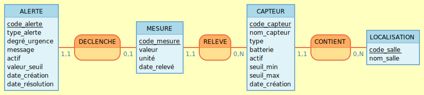

# Cahier des charges

## 1. Nom du projet :

- **Dashboard de supervision IoT**

## 2. Objectif :

Développer une application permettant de superviser des données issues de capteurs IoT afin de faciliter leur analyse, leur suivi et la détection d’anomalies.

## 3. MVP :

Fonctionnalités principales :

- Stocker les mesures dans une base de données
- Recevoir des données simulées via une API REST (générées par des scripts de seed)
- Visualiser les données sur un dashboard
- Afficher les informations clés sous forme de cartes de statut
- Filtrer les données par période (heure, jour, semaine, mois)
- Détecter et afficher des alertes en cas de dépassement de seuil
- Déploiement de l'API
- Déploiement de la base de données
- Déploiement du frontend (Affichage de la page Dashboard)

## 4. Évolutions potentielles :

- Consulter l’historique des mesures
- Consulter l’historique des alertes
- Connexion à un capteur physique réel
- Intégration du protocole MQTT pour la réception des données
- Authentification utilisateur (admin / utilisateur)
- Administration avancée des capteurs

## 5. Stack technique :

### Frontend

* React.js
* React Router
* Recharts
* SCSS
* Vite

### Backend

* Node.js
* Express.js

### Base de données

* PostgreSQL

### Tests

* Vitest
* REST Client

### Déploiement

* Vercel pour le frontend
* Render pour l’API
* Render Postgres pour la base de données

### Outils

* Git / GitHub
* Whimsical (Wireframes)
* Figma (Maquettes graphiques)
* Docker
* Docker Compose

## 6. Modélisation des données

### Location (Localisation)

Représente une pièce unique.

- id
- name

**Exemple :**

```json
{
  "id": 1,
  "name": "Salon"
}
```

---

### Sensor (Capteur)

Représente un capteur physique ou simulé.

Chaque capteur mesure un seul type de variable.

- id
- name
- type (temperature | humidity)
- battery
- is_active
- minimum_threshold
- maximum_threshold
- created_at
- location_id

**Exemple :**

```json
{
  "id": 1,
  "name": "Capteur température salon",
  "type": "temperature",
  "battery": 87,
  "is_active": true,
  "minimum_threshold": 18,
  "maximum_threshold": 28,
  "created_at": "2026-05-01T10:00:00Z",
  "location_id": 1
}
```

---

### Measure (Mesure)

Représente une mesure unique issue d’un capteur.

- id
- value
- unit
- recorded_at
- sensor_id

**Exemple :**

```json
{
  "id": 1,
  "value": 24.8,
  "unit": "°C",
  "recorded_at": "2026-05-01T10:15:00Z",
  "sensor_id": 1
}
```

---

### Alert (Alerte)

Représente une alerte unique issue d’une mesure.

- id
- type_alerte
- degré_urgence
- message
- is_active
- valeur_seuil
- date_creation
- date_resolution
- measure_id

**Exemple :**

```json
{
    "id": 1,
    "alert_type": "temperature_high",
    "urgency_degree": "warning",
    "message": "Température élevée - Salon",
    "is_active": true,
    "threshold_value": 28,
    "created_at": "2026-05-01T10:15:00Z",
    "resolved_at": null,
    "measure_id": 1
}
```

---

Pour l'élaboration de la base de donnée, nous suivrons la méthode de conception Merise :

### MCD



---

### MLD

```
location (id, name)

sensor (id, name, type, battery, is_active, minimum_threshold, maximum_threshold, created_at, #location_id)

measure (id, value, unit, recorded_at, #sensor_id)

alert (id, alert_type, urgency_degree, message, is_active, threshold_value, created_at, resolved_at, #measure_id)

```
---

### MPD

```sql
location (
  "id" INTEGER GENERATED ALWAYS AS IDENTITY PRIMARY KEY,
  "name" TEXT UNIQUE NOT NULL
);

sensor (
  "id" INTEGER GENERATED ALWAYS AS IDENTITY PRIMARY KEY,
  "name" TEXT UNIQUE NOT NULL,
  "type" TEXT NOT NULL,
  "battery" INTEGER NOT NULL CHECK ("battery" >= 0 AND battery <= 100),
  "is_active" BOOLEAN NOT NULL DEFAULT TRUE,
  "minimum_threshold" DOUBLE PRECISION NOT NULL,
  "maximum_threshold" DOUBLE PRECISION NOT NULL,
  "created_at" TIMESTAMP NOT NULL DEFAULT CURRENT_TIMESTAMP,
  "location_id" INTEGER NOT NULL REFERENCES location("id"),
  CHECK ("minimum_threshold" < "maximum_threshold")
);

measure (
  "id" INTEGER GENERATED ALWAYS AS IDENTITY PRIMARY KEY,
  "value" DOUBLE PRECISION NOT NULL,
  "unit" TEXT NOT NULL,
  "recorded_at" TIMESTAMP NOT NULL,
  "sensor_id" INTEGER NOT NULL REFERENCES sensor("id"),
  UNIQUE ("sensor_id", "recorded_at")
);

alert (
  "id" INTEGER GENERATED ALWAYS AS IDENTITY PRIMARY KEY,
  "alert_type" TEXT NOT NULL,
  "urgency_degree" TEXT NOT NULL,
  "message" TEXT NOT NULL,
  "is_active" BOOLEAN NOT NULL DEFAULT TRUE,
  "threshold_value" DOUBLE PRECISION NOT NULL,
  "created_at" TIMESTAMP NOT NULL DEFAULT CURRENT_TIMESTAMP,
  "resolved_at" TIMESTAMP,
  "measure_id" INTEGER UNIQUE NOT NULL REFERENCES measure("id")
);

```

---

### Relation entre les données

- Une **Location** peut avoir plusieurs **Sensor**
- Un **Sensor** peut avoir plusieurs **Measure**
- Chaque **Measure** est associée à un seul **Sensor** via `sensor_id`
- Chaque **Alert** est associée à une seule **Measure** via `measure_id`

---

### Gestion des alertes

Les seuils d’alerte sont définis au niveau du **Sensor**.

Une alerte est déclenchée si :

- la valeur est inférieure à `minimum_threshold`
- la valeur est supérieure à `maximum_threshold`

## 7. Roadmap (méthode agile) :

### Sprint 0 :

- Définition des besoins
- Modélisation des données
- Wireframes (Whimsical)
- Maquettes UI (Figma)

### Sprint 1 :

- Setup backend
- Création API REST
- Structure du projet

### Sprint 2 :

- Connexion PostgreSQL
- Implémentation du stockage des mesures

### Sprint 3 :

- Génération de données simulées (seed historique)
- Script de génération de données anormales (alertes)
- Implémentation des alertes (logique métier)
- Injection de données dans l’API

### Sprint 4 :

- Dashboard React (cartes + graphiques)
- Affichage des mesures
- Filtres temporels (heure / jour / semaine / mois)

### Sprint 5 :

- Affichage des alertes dans le dashboard
- Améliorations UI/UX

### Sprint 6 :

- Préparation Docker pour la production
- Configuration des variables d’environnement
- Déploiement de l’API sur Render
- Déploiement de PostgreSQL avec Render Postgres
- Déploiement du frontend sur Vercel

## 8. Conception UX/UI — Structure des interfaces

### Objectif

Définir la structure des interfaces utilisateur du MVP afin d’assurer une navigation claire, une lecture efficace des données et une cohérence globale de l’application.

---

### Structure de l’application

L’application sera composée de quatre pages principales :

- Dashboard
- Historique des mesures
- Détail d’un capteur
- Page des alertes

Aucun système d’authentification n’est prévu dans le MVP.

L’utilisateur accède directement au Dashboard.

---

### 1. Dashboard

### Objectif

Fournir une vue globale des données issues des capteurs afin de permettre une compréhension rapide de l’état du système.

### Contenu

- Header :
    - Titre de la page
    - Filtres temporels (heure, jour, semaine, mois)
- Cartes de statut :
    - Température actuelle
    - Humidité actuelle
    - Graphique principal :
        - Évolution des mesures dans le temps (dernières 24h par défaut)
- Alertes récentes :
    - Type
    - Niveau
    - Timestamp

---

### 2. Historique des mesures

### Objectif

Permettre l’analyse détaillée des données enregistrées.

### Contenu

- Filtres :
    - Période (heure, jour, semaine, mois)
    - Type de capteur (température, humidité)
- Tableau des mesures :
    - Timestamp
    - Capteur
    - Valeur
    - Unité
- Graphiques :
    - Visualisation des données en fonction des filtres appliqués

---

### 3. Détail d’un capteur

### Objectif

Afficher l’ensemble des informations relatives à un capteur spécifique.

### Contenu

- Informations générales :
    - Nom
    - Localisation
    - Type
- État du capteur :
    - Batterie
    - Statut
- Seuils d’alerte :
    - Valeur minimale
    - Valeur maximale
- Graphique dédié :
    - Évolution des mesures du capteur
- Historique :
    - Tableau des mesures associées
- Alertes :
    - Liste des alertes liées au capteur

---

### 4. Page des alertes

### Objectif

Centraliser les anomalies détectées sur les capteurs.

### Contenu

- Liste des alertes :
    - Type
    - Niveau
    - Timestamp
- Filtres :
    - Type de capteur
    - Niveau d’alerte
    - Période
- Navigation :
    - Accès au détail du capteur concerné

---

## 9. Navigation

L’application adopte une approche **mobile first**.

### Navigation mobile

Sur mobile, la navigation est pensée pour une utilisation simple et fluide :

- Organisation verticale des contenus (lecture de haut en bas)
- Accès aux différentes pages via la barre de navigation située en bas de page
- Navigation minimaliste afin de privilégier la lisibilité des données

---

### Navigation desktop

Sur desktop, l’application utilise une navigation latérale permettant d’accéder aux sections principales :

- Dashboard
- Historique des mesures
- Alertes

L’accès au détail d’un capteur se fait via des interactions contextuelles (dashboard, graphiques, alertes).

---

### Organisation des données — Dashboard

Les données du Dashboard sont organisées par **zone (pièce)** afin de refléter un cas d’usage réel.

Dans le cadre du MVP, l’application simule une habitation composée de trois zones :

- Salon
- Cuisine
- Chambre

Chaque zone est représentée par un groupe de cartes contenant :

- Température
- Humidité
- Un graphique associé

Le graphique affiche par défaut l’évolution des données sur une journée.

Cette organisation permet :

- Une lecture rapide par zone
- Une meilleure contextualisation des données
- Une navigation plus intuitive pour l’utilisateur